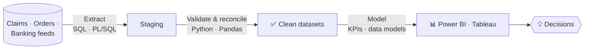

<div align="center">


<a href="https://linkedin.com/in/bairi-poojitha-3b225a1b3"></a>


</div>

```sql
-- 👋 Hi, I'm Poojitha (Pooji). Run this query to get to know me.
SELECT name, role, experience, domains, superpower
FROM   github.profiles
WHERE  username = 'bairipoojitha1299';
```

```text
+----------+--------------------------------------+------------+------------------------------+---------------------------------+
| name     | role                                 | experience | domains                      | superpower                      |
+----------+--------------------------------------+------------+------------------------------+---------------------------------+
| Poojitha | Data Analyst · Analytics Engineer    | 4+ years   | Healthcare claims, Banking,  | Raw data → validated pipeline → |
|          |                                      |            | Order management & finance   | dashboard → business decision   |
+----------+--------------------------------------+------------+------------------------------+---------------------------------+
(1 row)
```

## 🔄 How I work



## 📈 Impact report

```sql
SELECT metric, result FROM impact ORDER BY proud_of DESC;
```

| metric | result |
|---|---|
| Healthcare claims processed into clean datasets | **2M+ records / month** |
| Ad hoc data delivery time | **days → under 4 hours** |
| Downstream data accuracy (automated quality rules) | **+18%** |
| Reporting turnaround (Oracle EBS pipelines) | **same-week → same-day** |
| Banking issue diagnosis time | **1 day → under 3 hours** |
| Recurring production problems | **-25%** |
| Manual reporting effort | **-20 to 40%** |

## 📂 Featured projects

```sql
SELECT project, stack, headline_finding FROM portfolio ORDER BY featured;
```

| project | stack | headline finding |
|---|---|---|
| 🏗️ [**Olist ELT Pipeline**](https://github.com/bairipoojitha1299/olist-elt-pipeline) · raw CSVs → tested star schema, daily | Airflow · dbt · PostgreSQL · Docker · GitHub Actions | 550k rows loaded via COPY, 40+ dbt data tests, incremental fact table, CI on every push |
| 🛒 [**Brazilian E-Commerce Sales Analysis**](https://github.com/bairipoojitha1299/olist-ecommerce-analysis) · 100k real orders, 15 business questions | PostgreSQL · Python · Docker | Deliveries 8+ days late average **1.7★** vs **4.3★** when early; **97%** of customers never reorder |

## 🕓 Experience: `git log --oneline`

```text
* 2026-05  (HEAD -> main)  Data Analyst @ Humana · healthcare claims & provider analytics
* 2025-01  Graduate Assistant @ Texas State University · admissions data quality & reporting
* 2022-11  Analytics Engineer @ Infosys (client: Sony) · Oracle EBS order management & finance
* 2021-10  Analytics Engineer @ Infosys (client: Bank of America) · transaction analytics
* init     M.S. Data Analytics & Information Systems · Texas State University · 4.0 GPA
```

## 🗂️ Data catalog: my stack

| Layer | Tools |
|---|---|
| **Query & Code** |    |
| **Databases** |    |
| **Analyze & Visualize** |    |
| **Python libraries** |     |
| **Cloud & Workflow** |   |
| **AI (exploring)** |    |

## 🏅 Certifications

```sql
SELECT certification, issuer FROM credentials;
```

| certification | issuer |
|---|---|
| Google Data Analytics | Google · Coursera |
| Databases and SQL for Data Science with Python | IBM · Coursera |
| AWS Certified Cloud Practitioner | Amazon Web Services |
| Google AI Essentials | Google · Coursera |
| Neural Networks and Deep Learning | DeepLearning.AI · Coursera |
| Data Analysis and Visualization with Python | Jovian |

## 📊 Pipeline uptime (a.k.a. my commit streak)

<div align="center">

<br/><br/>

</div>

## 📬 Live log

```bash
$ tail -f /var/log/poojitha.log
[INFO]  Open to Data Analyst · Analytics Engineer · Data Engineer roles
[INFO]  Currently exploring: RAG, vector search & AI-powered analytics
[INFO]  Reach me: linkedin.com/in/bairi-poojitha-3b225a1b3
[WARN]  Will happily talk about data quality for too long ☕
```

<div align="center"><sub>-- end of query · thanks for stopping by --</sub></div>
